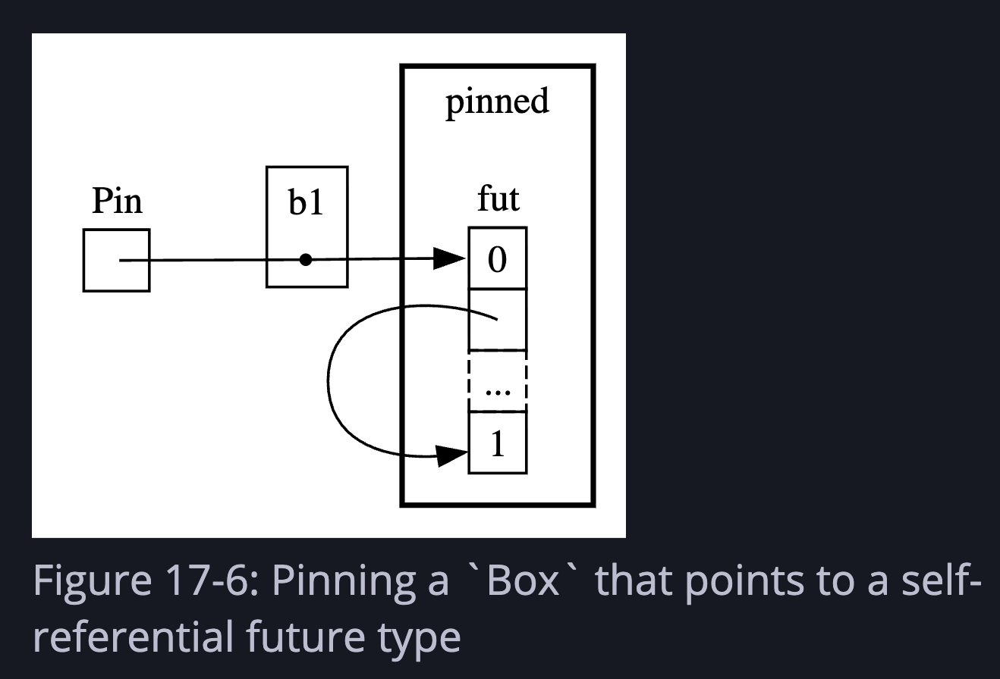
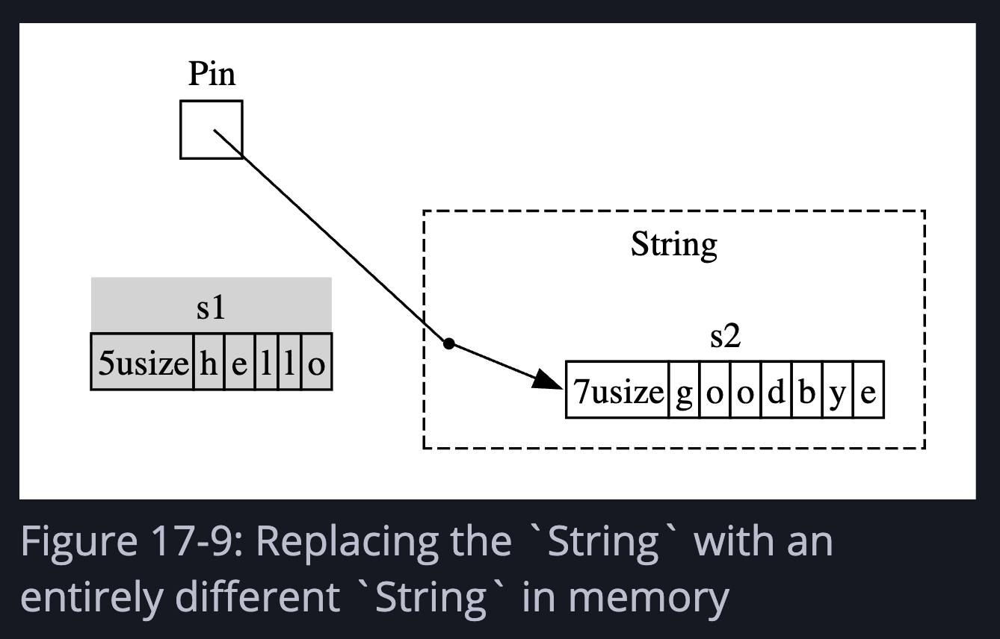

# Ch 17 — Async and Await

Async is another tool for concurrency — different from threads, complementary to them. The core idea: instead of blocking a thread while waiting on I/O, hand control back to the runtime and let it do something else until the result is ready.


Two kinds of work to keep in mind:
- **CPU-bound** — limited by processing speed (e.g. video encoding). More CPU = faster.
- **I/O-bound** — limited by waiting (e.g. network, disk). CPU is mostly idle. This is where async shines.

---

## 17.1 — Futures and Syntax

### Futures

A **future** is a value that may not be ready yet but will be at some point. Any type that implements the `Future` trait is a future.

Futures are **lazy** — they don't run until you `.await` them. Same idea as iterators not doing anything until you call `.next()`.

```rust
async fn page_title(url: &str) -> Option<String> {
    let response_text = trpl::get(url).await.text().await;
    Html::parse(&response_text)
        .select_first("title")
        .map(|title| title.inner_html())
}
```

- `async fn` marks a function as async — it returns a future instead of its stated return type directly
- `.await` is **postfix** (unlike C# / JS where it's a prefix keyword) — this lets you chain: `trpl::get(url).await.text().await`
- Each `.await` is a potential pause point — "wait here until this future is ready, but let other things run in the meantime"

### What `async fn` compiles to

The compiler transforms this:

```rust
async fn page_title(url: &str) -> Option<String> { ... }
```

Into roughly this:

```rust
fn page_title(url: &str) -> impl Future<Output = Option<String>> {
    async move { ... }
}
```

The `Output` associated type matches the original return type. Under the hood, Rust builds a **state machine** that tracks which await point the function is paused at.

### `main` can't be async

`main` is the program's entry point — it has to set up the runtime. It can't itself be a future because something has to drive it. Use `block_on` from a runtime to bridge sync → async:

```rust
fn main() {
    trpl::block_on(async {
        let url = &args[1];
        match page_title(url).await {
            Some(title) => println!("The title for {url} was {title}"),
            None => println!("{url} had no title"),
        }
    })
}
```

`block_on` takes a future and blocks the current thread until it completes. It sets up a tokio runtime under the hood.

### Racing two futures with `select`

Full working example — async web scraper that races two URLs and reports which loads first:

```rust
use trpl::{Either, Html};

fn main() {
    let args: Vec<String> = std::env::args().collect();

    trpl::block_on(async {
        let title_fut_1 = page_title(&args[1]);
        let title_fut_2 = page_title(&args[2]);

        let (url, maybe_title) = match trpl::select(title_fut_1, title_fut_2).await {
            Either::Left(left) => left,
            Either::Right(right) => right,
        };

        println!("{url} returned first");

        match maybe_title {
            Some(title) => println!("Its page title was: '{title}'"),
            None => println!("It had no title"),
        }
    })
}

async fn page_title(url: &str) -> (&str, Option<String>) {
    let response_text = trpl::get(url).await.text().await;
    let title = Html::parse(&response_text)
        .select_first("title")
        .map(|title| title.inner_html());

    (url, title)
}
```

Breaking it down:

**`page_title` is an async fn** — returns a future. Its actual return type is `impl Future<Output = (&str, Option<String>)>`. It returns a tuple of the URL (so the caller knows which site it was) and the page title if one exists.

**Inside `page_title`:**
- `trpl::get(url).await` — fires the HTTP request and pauses here until the response headers arrive. The `.await` is what yields control back to the runtime while waiting on the network.
- `.text().await` — reads the response body. Also async — the body may still be streaming in.
- `Html::parse(...)` — parses the HTML string synchronously (no await needed)
- `.select_first("title")` — finds the first `<title>` element, returns `Option`
- `.map(|title| title.inner_html())` — if it exists, extract the text inside the tag

**Inside `main`:**
- `let title_fut_1 = page_title(&args[1])` — this does **not** start the request. It creates the future (lazy). Same for `title_fut_2`. Both are sitting there doing nothing yet.
- `trpl::select(title_fut_1, title_fut_2).await` — now both futures start being polled. Whichever network response arrives first wins. Returns `Either::Left(value)` if the first future won, `Either::Right(value)` if the second did.
- The `match` just unpacks either variant — both arms produce the same tuple type `(&str, Option<String>)`, so `(url, maybe_title)` gets bound regardless of which won.
- The loser future is dropped — its request may still be in-flight on the network, but we stop caring about it.

**`Either` is not success/failure** — it just means "which one." `Left` = first arg won, `Right` = second arg won. No relationship to `Ok`/`Err`.

**Not fair** — `select` polls its first argument first on each round. If both are ready simultaneously, `title_fut_1` wins. Slight but real bias.

---

## 17.2 — Concurrency with Async

### Spawning tasks

`trpl::spawn_task` is the async equivalent of `thread::spawn`:

```rust
use std::time::Duration;

fn main() {
    trpl::block_on(async {
        trpl::spawn_task(async {
            for i in 1..10 {
                println!("hi number {i} from the first task!");
                trpl::sleep(Duration::from_millis(500)).await;
            }
        });

        for i in 1..5 {
            println!("hi number {i} from the second task!");
            trpl::sleep(Duration::from_millis(500)).await;
        }
    })
}
```

Breaking it down:

- `trpl::block_on` sets up the async runtime and drives the outer future to completion — same as before, necessary because `main` can't be async
- `trpl::spawn_task(async { ... })` launches the inner async block as an independent task — it starts running concurrently with the rest of `block_on`'s body
- `trpl::sleep(...).await` is the key: each time either task hits a sleep, it yields control back to the runtime, which then runs the other task. This is how they interleave — they take turns at each await point
- The spawned task counts to 10, the main task counts to 5. When the main task's loop finishes, `block_on` exits and the spawned task is **killed** — it won't finish printing all 10 numbers

To let the spawned task finish, capture the handle and await it:

```rust
use std::time::Duration;

fn main() {
    trpl::block_on(async {
        let handle = trpl::spawn_task(async {
            for i in 1..10 {
                println!("hi number {i} from the first task!");
                trpl::sleep(Duration::from_millis(500)).await;
            }
        });

        for i in 1..5 {
            println!("hi number {i} from the second task!");
            trpl::sleep(Duration::from_millis(500)).await;
        }

        handle.await.unwrap();
    });
}
```

- `spawn_task` returns a `JoinHandle` — same concept as `thread::spawn`
- `handle.await.unwrap()` — the `.await` is new here vs threads (where you'd call `.join()`). It pauses the outer async block until the spawned task completes. Without this line, `block_on` exits after the main loop finishes and the spawned task is killed mid-run.
- Both tasks still interleave while the main loop is running — `handle.await` only kicks in after the main loop is done, at which point it waits for the spawned task to finish its remaining iterations.

### `trpl::join` — run futures concurrently

Instead of spawning tasks, you can use `join` to run multiple futures concurrently within the same task:

```rust
let fut1 = async {
    for i in 1..10 {
        println!("hi {i} from fut1");
        trpl::sleep(Duration::from_millis(500)).await;
    }
};

let fut2 = async {
    for i in 1..5 {
        println!("hi {i} from fut2");
        trpl::sleep(Duration::from_millis(500)).await;
    }
};

trpl::join(fut1, fut2).await;
```

`trpl::join` is **fair** — it checks each future equally often. Output will alternate deterministically.

### Message passing with async channels

Async channels work like `mpsc` from ch16, but `recv` is async. First, the naive version that seems like it should work but doesn't behave as expected:

```rust
let (tx, mut rx) = trpl::channel();

let vals = vec![
    String::from("hi"),
    String::from("from"),
    String::from("the"),
    String::from("future"),
];

for val in vals {
    tx.send(val).unwrap();
    trpl::sleep(Duration::from_millis(500)).await;
}

while let Some(value) = rx.recv().await {
    println!("received '{value}'");
}
```

This is all in one async block, so it runs **sequentially** — the entire send loop finishes first (all 4 messages sent, with 500ms sleeps between them), then the while loop runs and prints all 4 at once. Not the trickling effect you'd expect.

The fix is splitting send and recv into separate async blocks so the runtime can interleave them:

```rust
let (tx, mut rx) = trpl::channel();

let tx_fut = async move {
    let vals = vec!["hi", "from", "the", "future"];
    for val in vals {
        tx.send(val).unwrap();
        trpl::sleep(Duration::from_millis(500)).await;
    }
    // tx dropped here — channel closes
};

let rx_fut = async {
    while let Some(value) = rx.recv().await {
        println!("received '{value}'");
    }
};

trpl::join(tx_fut, rx_fut).await;
```

- `let (tx, mut rx) = trpl::channel()` — `rx` must be `mut` because `recv()` mutates internal state
- `send()` is synchronous — no `.await` needed
- `rx.recv().await` — async, pauses until a message arrives or channel closes
- `while let Some(value)` — `recv()` returns `None` when the channel is closed (tx dropped), which ends the loop
- `async move` on `tx_fut` — moves `tx` into the block so it's dropped when the block finishes, closing the channel. Without this, `rx` would wait forever
- `trpl::join` runs both futures concurrently — tx sends one, yields; rx receives it, yields; tx sends another, and so on

### Multiple producers with `join!` macro

```rust
let tx1 = tx.clone();

let tx1_fut = async move {
    for val in ["hi", "from", "the", "future"] {
        tx1.send(val).unwrap();
        trpl::sleep(Duration::from_millis(500)).await;
    }
};

let tx_fut = async move {
    for val in ["more", "messages", "for", "you"] {
        tx.send(val).unwrap();
        trpl::sleep(Duration::from_millis(1500)).await;
    }
};

let rx_fut = async {
    while let Some(value) = rx.recv().await {
        println!("received '{value}'");
    }
};

trpl::join!(tx1_fut, tx_fut, rx_fut); // macro version for 3+ futures
```

Use `join!` (macro) when you have more than two futures. Both tx handles must be in `async move` blocks so they're both dropped when done.

---

## 17.3 — Working with Any Number of Futures

### Starvation

The runtime can only switch tasks at **await points**. If an async block does a lot of CPU work without any awaits, it blocks all other futures — called **starving** them.

```rust
// Bad — no await points between slow calls
let a = async {
    slow("a", 30);
    slow("a", 10); // b can't run until all of these finish
    slow("a", 20);
    trpl::sleep(Duration::from_millis(50)).await;
};
```

Fix: add await points between chunks of work:

```rust
let a = async {
    slow("a", 30);
    trpl::yield_now().await; // hand control back to runtime
    slow("a", 10);
    trpl::yield_now().await;
    slow("a", 20);
    trpl::yield_now().await;
};
```

`yield_now()` immediately hands control back to the runtime without any actual delay — faster than `sleep(1ms)` because timers have a minimum granularity.

### Building async abstractions — custom `timeout`

Futures compose naturally. Example: a `timeout` function that races a future against a sleep:

```rust
async fn timeout<F: Future>(
    future_to_try: F,
    max_time: Duration,
) -> Result<F::Output, Duration> {
    match trpl::select(future_to_try, trpl::sleep(max_time)).await {
        Either::Left(output) => Ok(output),   // future finished first
        Either::Right(_) => Err(max_time),    // timeout elapsed first
    }
}
```

Usage:

```rust
match timeout(slow_future, Duration::from_secs(2)).await {
    Ok(msg) => println!("Succeeded: {msg}"),
    Err(d)  => println!("Timed out after {}s", d.as_secs()),
}
```

This is the composability payoff — simple building blocks (`select`, `sleep`) combine into useful higher-level abstractions.

---

## 17.4 — Streams

A **stream** is the async version of an iterator — a sequence of values that arrive over time.

Iterator: synchronous, `next()` returns immediately  
Stream: asynchronous, `next().await` waits until the next value is ready

### Basic stream usage

```rust
use trpl::StreamExt; // required to get .next() on streams

let values = [1, 2, 3, 4, 5, 6, 7, 8, 9, 10];
let iter = values.iter().map(|n| n * 2);
let mut stream = trpl::stream_from_iter(iter);

while let Some(value) = stream.next().await {
    println!("The value was: {value}");
}
```

`StreamExt` is a trait that provides higher-level methods on streams (like `Iterator` does for iterators). Must be imported — doesn't come in scope automatically.

**Streams are useful for:** chunked file/network reads, event queues, throttling UI events, anything where values arrive asynchronously over time.

---

## 17.5 — The Traits Behind Async

### `Future` trait

```rust
pub trait Future {
    type Output;
    fn poll(self: Pin<&mut Self>, cx: &mut Context<'_>) -> Poll<Self::Output>;
}

pub enum Poll<T> {
    Ready(T),
    Pending,
}
```

The runtime calls `poll` repeatedly to check if a future is done:
- `Pending` — not ready, check again later
- `Ready(T)` — done, here's the value

Don't call `poll` again after `Ready` — many futures will panic.

### `Pin` and `Unpin`

When Rust compiles an `async` block into a state machine, that state machine can end up **self-referential** — it holds a pointer to data that lives inside itself (e.g. a reference to a local variable across an await point). This is normally fine, but it creates a problem: if you move the state machine to a different memory address, the internal pointer still points to the old address. Dangling pointer, undefined behavior.

`Pin<P>` solves this by wrapping a pointer type and making a guarantee: **the data it points to will not move in memory**.

```rust
Pin<Box<SomeType>>  // Box can move (it's just a pointer), but SomeType is stuck in place
```

So the box itself can be copied around, but the heap allocation it points to stays at the same address — which keeps any internal self-references valid.

`Unpin` is a marker trait meaning "this type is safe to move even when wrapped in Pin." Most normal Rust types implement `Unpin` automatically because they have no internal pointers. The types that don't (`!Unpin`) are the self-referential async state machines the compiler generates.



The diagram shows `Pin` wrapping `b1` (a Box), which points to `fut` pinned in memory. The self-referential arrow inside `fut` points from one field back to another field within the same struct — if the whole thing moved, that internal pointer would be wrong. `Pin` prevents the move.

An important nuance: `Pin` locks the **memory address**, not the **value at that address**. For types that implement `Unpin` (like `String`), you can still replace the contents even through a `Pin` — the pointer stays the same but the data can change:



`Pin` still points to the same location, but `s1` ("hello") was replaced with `s2` ("goodbye"). This is fine for `Unpin` types because they have no internal self-references to break. For `!Unpin` types (async state machines), `Pin` prevents this kind of replacement too — the whole point is those types can't safely be moved or swapped out.

In practice you rarely touch `Pin` directly — `.await` handles all of this for you. It surfaces when you need to put futures into a collection:

```rust
use std::pin::pin;

// pin!() macro pins a future to the stack — it can't be moved after this
let futures: Vec<Pin<&mut dyn Future<Output = ()>>> =
    vec![pin!(fut1), pin!(fut2), pin!(fut3)];

trpl::join_all(futures).await;
```

Without pinning, the compiler won't let you store `!Unpin` futures in a `Vec` because moving them into the vec could invalidate their internal pointers.

### `Stream` trait

```rust
trait Stream {
    type Item;
    fn poll_next(self: Pin<&mut Self>, cx: &mut Context<'_>) -> Poll<Option<Self::Item>>;
}
```

Combines `Future` and `Iterator`. `poll_next` returns:
- `Poll::Pending` — no item ready yet
- `Poll::Ready(Some(item))` — here's the next item
- `Poll::Ready(None)` — stream is done

`StreamExt` builds on top of this with ergonomic methods like `.next().await`.

---

## 17.6 — Futures, Tasks, and Threads

Three levels of concurrency, coarsest to finest:

| Level | Managed by | Good for |
|---|---|---|
| Threads | OS | CPU-bound parallelism |
| Tasks | Async runtime | I/O-bound concurrency |
| Futures | Compiler (state machines) | Fine-grained await points within a task |

**Key difference threads vs tasks:**
- Threads: OS switches between them, separate memory, relatively heavyweight
- Tasks: runtime switches between them at await points, share memory within a runtime, lightweight
- Tasks can interleave futures *within* a single task — concurrency at multiple levels

**Embedded relevance:** threads are an OS concept — no OS means no threads. On bare metal (e.g. RP2040), `std::thread` is not available. Async works because the runtime is just a library, not an OS feature. Embassy is an async executor designed specifically for no-OS embedded targets — this is why it's the right choice for the Pico. You get concurrency without needing an OS at all.

### Using both together

Threads and async aren't mutually exclusive:

```rust
let (tx, mut rx) = trpl::channel();

use std::{thread, time::Duration};

fn main() {
    let (tx, mut rx) = trpl::channel();

    thread::spawn(move || {
        for i in 1..11 {
            tx.send(i).unwrap();
            thread::sleep(Duration::from_secs(1)); // blocking sleep — fine on its own thread
        }
    });

    trpl::block_on(async {
        while let Some(message) = rx.recv().await {
            println!("{message}");
        }
    });
}
```

The thread does blocking CPU/IO work and sends results over a channel. The async block receives them without blocking the runtime — `rx.recv().await` yields control between messages. You don't have to pick one model; threads and async compose naturally via channels.

Real-world example: video encoding on a dedicated thread (CPU-bound), notifying the UI via async channel (I/O-bound).

### Rules of thumb

- CPU-bound, parallelizable work → threads
- I/O-bound, highly concurrent work → async
- Need both → combine them

---

## Summary

| Concept | What it is |
|---|---|
| `Future` | A value that will be ready eventually; lazy until polled |
| `async fn` | Returns a future; compiled into a state machine |
| `.await` | Pause here until the future is ready; yield control in the meantime |
| `block_on` | Bridge from sync to async; drives a future to completion |
| `spawn_task` | Launch an async task (like `thread::spawn` for futures) |
| `join` / `join!` | Run multiple futures concurrently, wait for all |
| `select` | Race futures, return whichever finishes first |
| `yield_now` | Hand control back to runtime immediately (no artificial delay) |
| Stream | Async iterator — values arrive over time |
| `Pin` | Prevents a value from moving in memory (needed for self-referential futures) |
| `Unpin` | Marker: this type is safe to move even when "pinned" |
