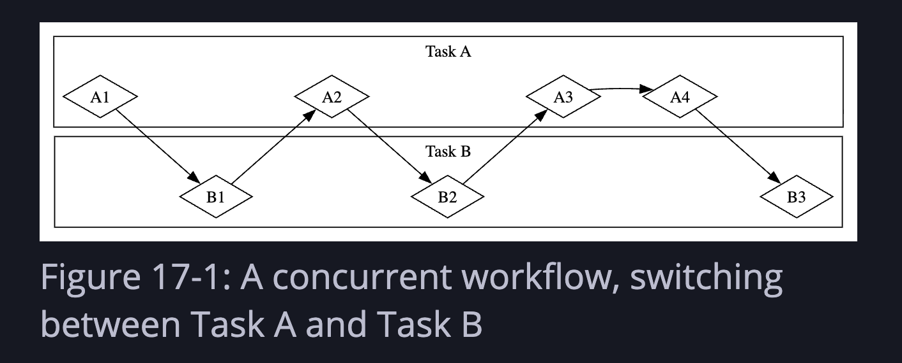
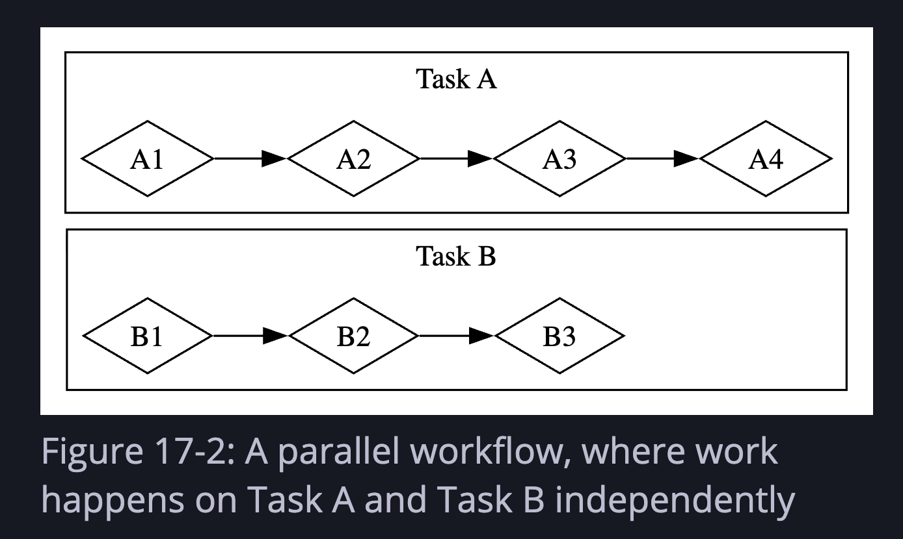

# Ch 17 — Async and Await

Async is another tool for concurrency — different from threads, complementary to them. The core idea: instead of blocking a thread while waiting on I/O, hand control back to the runtime and let it do something else until the result is ready.




Two kinds of work to keep in mind:
- **CPU-bound** — limited by processing speed (e.g. video encoding). More CPU = faster.
- **I/O-bound** — limited by waiting (e.g. network, disk). CPU is mostly idle. This is where async shines.

---

## 17.1 — Futures and Syntax

### Futures

A **future** is a value that may not be ready yet but will be at some point. Any type that implements the `Future` trait is a future.

Futures are **lazy** — they don't run until you `.await` them. Same idea as iterators not doing anything until you call `.next()`.

```rust
async fn page_title(url: &str) -> Option<String> {
    let response_text = trpl::get(url).await.text().await;
    Html::parse(&response_text)
        .select_first("title")
        .map(|title| title.inner_html())
}
```

- `async fn` marks a function as async — it returns a future instead of its stated return type directly
- `.await` is **postfix** (unlike C# / JS where it's a prefix keyword) — this lets you chain: `trpl::get(url).await.text().await`
- Each `.await` is a potential pause point — "wait here until this future is ready, but let other things run in the meantime"

### What `async fn` compiles to

The compiler transforms this:

```rust
async fn page_title(url: &str) -> Option<String> { ... }
```

Into roughly this:

```rust
fn page_title(url: &str) -> impl Future<Output = Option<String>> {
    async move { ... }
}
```

The `Output` associated type matches the original return type. Under the hood, Rust builds a **state machine** that tracks which await point the function is paused at.

### `main` can't be async

`main` is the program's entry point — it has to set up the runtime. It can't itself be a future because something has to drive it. Use `block_on` from a runtime to bridge sync → async:

```rust
fn main() {
    trpl::block_on(async {
        let url = &args[1];
        match page_title(url).await {
            Some(title) => println!("The title for {url} was {title}"),
            None => println!("{url} had no title"),
        }
    })
}
```

`block_on` takes a future and blocks the current thread until it completes. It sets up a tokio runtime under the hood.

### Racing two futures with `select`

```rust
let title_fut_1 = page_title(&args[1]);
let title_fut_2 = page_title(&args[2]);

let (url, maybe_title) =
    match trpl::select(title_fut_1, title_fut_2).await {
        Either::Left(left) => left,
        Either::Right(right) => right,
    };
```

- Both futures are created but **not started** — they're lazy until polled
- `trpl::select` races them, returns whichever finishes first as `Either::Left` or `Either::Right`
- **Not fair** — polls its first argument first, so the first future has a slight priority advantage

---

## 17.2 — Concurrency with Async

### Spawning tasks

`trpl::spawn_task` is the async equivalent of `thread::spawn`:

```rust
trpl::block_on(async {
    let handle = trpl::spawn_task(async {
        for i in 1..10 {
            println!("hi {i} from spawned task");
            trpl::sleep(Duration::from_millis(500)).await;
        }
    });

    for i in 1..5 {
        println!("hi {i} from main task");
        trpl::sleep(Duration::from_millis(500)).await;
    }

    handle.await.unwrap(); // wait for spawned task to finish
});
```

Same rule as threads: the spawned task is killed when the outer block ends unless you `.await` the handle.

### `trpl::join` — run futures concurrently

Instead of spawning tasks, you can use `join` to run multiple futures concurrently within the same task:

```rust
let fut1 = async {
    for i in 1..10 {
        println!("hi {i} from fut1");
        trpl::sleep(Duration::from_millis(500)).await;
    }
};

let fut2 = async {
    for i in 1..5 {
        println!("hi {i} from fut2");
        trpl::sleep(Duration::from_millis(500)).await;
    }
};

trpl::join(fut1, fut2).await;
```

`trpl::join` is **fair** — it checks each future equally often. Output will alternate deterministically.

### Message passing with async channels

```rust
let (tx, mut rx) = trpl::channel();

let tx_fut = async move {
    let vals = vec!["hi", "from", "the", "future"];
    for val in vals {
        tx.send(val).unwrap();
        trpl::sleep(Duration::from_millis(500)).await;
    }
    // tx dropped here — channel closes
};

let rx_fut = async {
    while let Some(value) = rx.recv().await {
        println!("received '{value}'");
    }
};

trpl::join(tx_fut, rx_fut).await;
```

Key points:
- `rx.recv()` returns a future — must be `.await`ed
- `send()` doesn't need `.await` — it's not async
- `async move` on the tx block ensures `tx` is dropped when it finishes, closing the channel
- Without that, `rx_fut` would wait forever for more messages

**Why separate blocks matter:** within a single async block, code runs linearly between await points. If you put both send and recv logic in one block, all the sends happen first, then all the recvs. Splitting them into separate futures lets the runtime interleave them.

### Multiple producers with `join!` macro

```rust
let tx1 = tx.clone();

let tx1_fut = async move {
    for val in ["hi", "from", "the", "future"] {
        tx1.send(val).unwrap();
        trpl::sleep(Duration::from_millis(500)).await;
    }
};

let tx_fut = async move {
    for val in ["more", "messages", "for", "you"] {
        tx.send(val).unwrap();
        trpl::sleep(Duration::from_millis(1500)).await;
    }
};

let rx_fut = async {
    while let Some(value) = rx.recv().await {
        println!("received '{value}'");
    }
};

trpl::join!(tx1_fut, tx_fut, rx_fut); // macro version for 3+ futures
```

Use `join!` (macro) when you have more than two futures. Both tx handles must be in `async move` blocks so they're both dropped when done.

---

## 17.3 — Working with Any Number of Futures

### Starvation

The runtime can only switch tasks at **await points**. If an async block does a lot of CPU work without any awaits, it blocks all other futures — called **starving** them.

```rust
// Bad — no await points between slow calls
let a = async {
    slow("a", 30);
    slow("a", 10); // b can't run until all of these finish
    slow("a", 20);
    trpl::sleep(Duration::from_millis(50)).await;
};
```

Fix: add await points between chunks of work:

```rust
let a = async {
    slow("a", 30);
    trpl::yield_now().await; // hand control back to runtime
    slow("a", 10);
    trpl::yield_now().await;
    slow("a", 20);
    trpl::yield_now().await;
};
```

`yield_now()` immediately hands control back to the runtime without any actual delay — faster than `sleep(1ms)` because timers have a minimum granularity.

### Building async abstractions — custom `timeout`

Futures compose naturally. Example: a `timeout` function that races a future against a sleep:

```rust
async fn timeout<F: Future>(
    future_to_try: F,
    max_time: Duration,
) -> Result<F::Output, Duration> {
    match trpl::select(future_to_try, trpl::sleep(max_time)).await {
        Either::Left(output) => Ok(output),   // future finished first
        Either::Right(_) => Err(max_time),    // timeout elapsed first
    }
}
```

Usage:

```rust
match timeout(slow_future, Duration::from_secs(2)).await {
    Ok(msg) => println!("Succeeded: {msg}"),
    Err(d)  => println!("Timed out after {}s", d.as_secs()),
}
```

This is the composability payoff — simple building blocks (`select`, `sleep`) combine into useful higher-level abstractions.

---

## 17.4 — Streams

A **stream** is the async version of an iterator — a sequence of values that arrive over time.

Iterator: synchronous, `next()` returns immediately  
Stream: asynchronous, `next().await` waits until the next value is ready

### Basic stream usage

```rust
use trpl::StreamExt; // required to get .next() on streams

let values = [1, 2, 3, 4, 5, 6, 7, 8, 9, 10];
let iter = values.iter().map(|n| n * 2);
let mut stream = trpl::stream_from_iter(iter);

while let Some(value) = stream.next().await {
    println!("The value was: {value}");
}
```

`StreamExt` is a trait that provides higher-level methods on streams (like `Iterator` does for iterators). Must be imported — doesn't come in scope automatically.

**Streams are useful for:** chunked file/network reads, event queues, throttling UI events, anything where values arrive asynchronously over time.

---

## 17.5 — The Traits Behind Async

### `Future` trait

```rust
pub trait Future {
    type Output;
    fn poll(self: Pin<&mut Self>, cx: &mut Context<'_>) -> Poll<Self::Output>;
}

pub enum Poll<T> {
    Ready(T),
    Pending,
}
```

The runtime calls `poll` repeatedly to check if a future is done:
- `Pending` — not ready, check again later
- `Ready(T)` — done, here's the value

Don't call `poll` again after `Ready` — many futures will panic.

### `Pin` and `Unpin`

Async state machines can be **self-referential** — they contain internal pointers to their own data (tracking which await point they're at). If such a future is moved in memory, those pointers become invalid.

`Pin<P>` wraps a pointer and guarantees the pointed-to data won't move:

```rust
Pin<Box<SomeType>>  // the Box can move, but SomeType stays put
```

`Unpin` is a marker trait for types that are safe to move even when "pinned" — most normal types implement it automatically. The types that don't (`!Unpin`) are the self-referential async state machines.

In day-to-day code you mostly don't touch `Pin` directly — `await` handles it. It becomes relevant when:
- Collecting futures into a `Vec` for `join_all`
- Building low-level async primitives

```rust
// When you need to store futures in a collection:
let futures: Vec<Pin<&mut dyn Future<Output = ()>>> =
    vec![pin!(fut1), pin!(fut2), pin!(fut3)];

trpl::join_all(futures).await;
```

### `Stream` trait

```rust
trait Stream {
    type Item;
    fn poll_next(self: Pin<&mut Self>, cx: &mut Context<'_>) -> Poll<Option<Self::Item>>;
}
```

Combines `Future` and `Iterator`. `poll_next` returns:
- `Poll::Pending` — no item ready yet
- `Poll::Ready(Some(item))` — here's the next item
- `Poll::Ready(None)` — stream is done

`StreamExt` builds on top of this with ergonomic methods like `.next().await`.

---

## 17.6 — Futures, Tasks, and Threads

Three levels of concurrency, coarsest to finest:

| Level | Managed by | Good for |
|---|---|---|
| Threads | OS | CPU-bound parallelism |
| Tasks | Async runtime | I/O-bound concurrency |
| Futures | Compiler (state machines) | Fine-grained await points within a task |

**Key difference threads vs tasks:**
- Threads: OS switches between them, separate memory, relatively heavyweight
- Tasks: runtime switches between them at await points, share memory within a runtime, lightweight
- Tasks can interleave futures *within* a single task — concurrency at multiple levels

### Using both together

Threads and async aren't mutually exclusive:

```rust
let (tx, mut rx) = trpl::channel();

// CPU-bound work on a thread
thread::spawn(move || {
    for i in 1..11 {
        tx.send(i).unwrap();
        thread::sleep(Duration::from_secs(1));
    }
});

// Async receiver
trpl::block_on(async {
    while let Some(message) = rx.recv().await {
        println!("{message}");
    }
});
```

Real-world example: video encoding on a dedicated thread (CPU-bound), notifying the UI via async channel (I/O-bound).

### Rules of thumb

- CPU-bound, parallelizable work → threads
- I/O-bound, highly concurrent work → async
- Need both → combine them

---

## Summary

| Concept | What it is |
|---|---|
| `Future` | A value that will be ready eventually; lazy until polled |
| `async fn` | Returns a future; compiled into a state machine |
| `.await` | Pause here until the future is ready; yield control in the meantime |
| `block_on` | Bridge from sync to async; drives a future to completion |
| `spawn_task` | Launch an async task (like `thread::spawn` for futures) |
| `join` / `join!` | Run multiple futures concurrently, wait for all |
| `select` | Race futures, return whichever finishes first |
| `yield_now` | Hand control back to runtime immediately (no artificial delay) |
| Stream | Async iterator — values arrive over time |
| `Pin` | Prevents a value from moving in memory (needed for self-referential futures) |
| `Unpin` | Marker: this type is safe to move even when "pinned" |
